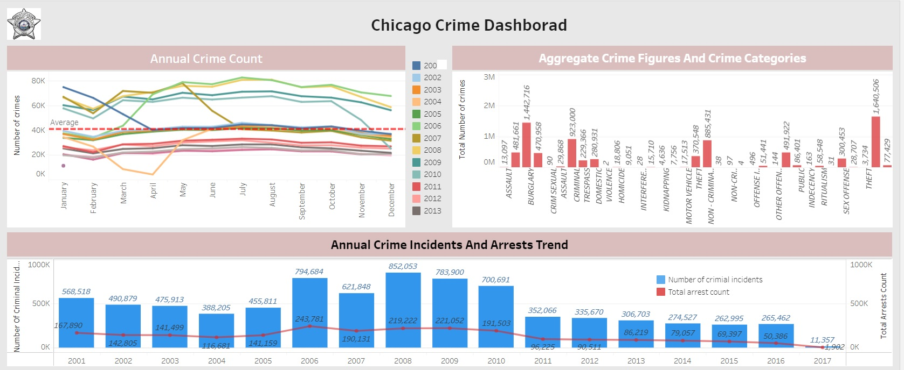
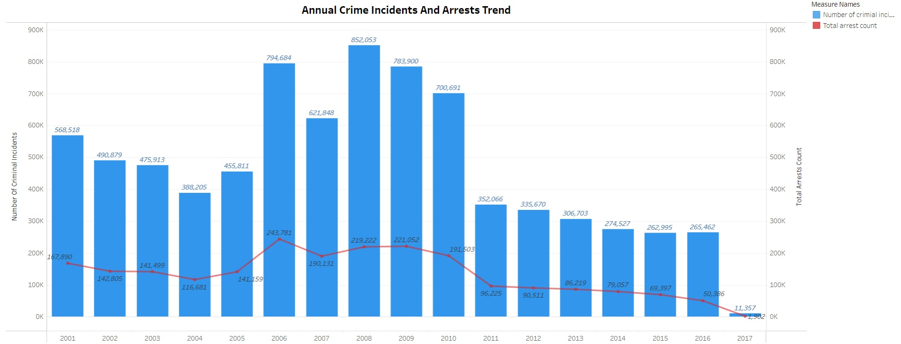
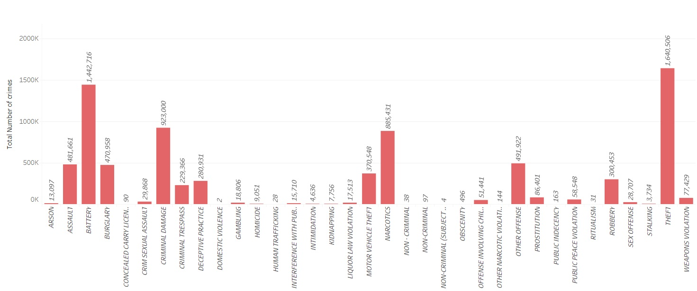

    # CognoRise Infotech

## Project 1: Crimes In Chicago

### Dashboard link: 
https://public.tableau.com/views/Chicago_crime_dashborad/Dashboard1?:language=en-US&:sid=&:display_count=n&:origin=viz_share_link

### Annual Crime Incidents And Arrest Trends
https://public.tableau.com/views/Annual_crime_incidents_and_arrest_trend/AnnualCrimeIncidentsandArrestsTrend?:language=en-US&:sid=&:display_count=n&:origin=viz_share_link

### Total Number Of Crimes By Type

