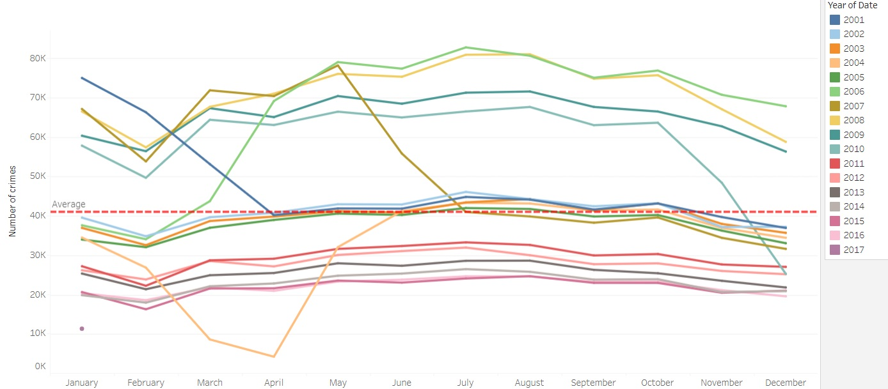
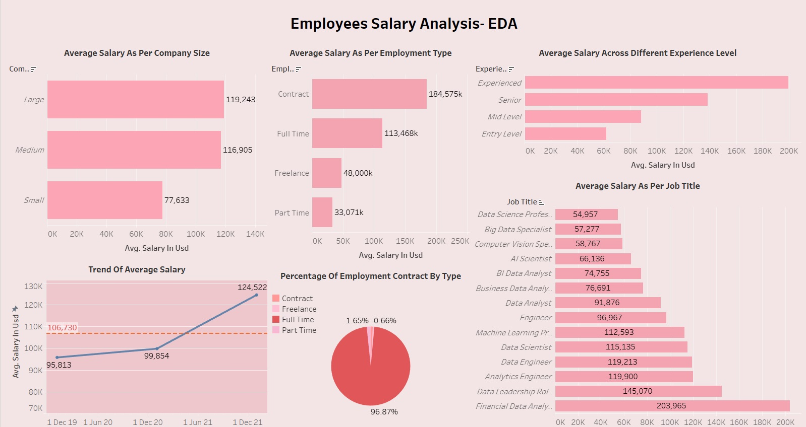

 
CognoRise Infotech

## Project 1: Crimes In Chicago

The objective of this project is to conduct a comprehensive analysis of crime incidents and their respective types within the city of Chicago.I have utilized the dataset available at https://www.kaggle.com/datasets/currie32/crimes-in-chicago, which was provided by the Chicago Police Department.
The dataset comprises over 6,000,000 records/rows of data, exceeding the viewing capacity of Microsoft Excel.The dataset is segmented into four CSV files.Before working in Tableau, I created a single CSV file on Kaggle, using the fields of interest for exploration. The Kaggle notebook is provided in the repository for reference.
The variables I utilized are as follows:
- Arrest - Specifies whether an arrest was made.
- Primary Type - Description od IUCR code, which standes for which stands for the Illinois Uniform Crime Reporting code.See the list  of IUCR codes at https://data.cityofchicago.org/d/c7ck-438e.
- Date - When the incident happened.
- Domestic - Specifies whether the incident can be classified as domestic-related according to the Domestic Violence Act.
- Description - Further detailed description of the IUCR code.
- Latitude - The latitude coordinates of the incident location.
- Longitude - The longtitude coordinates of the incident location.
### Dashboard link: 
I have developed a dashboard to visualize the patterns of crime incidents and their respective types over the years.

https://public.tableau.com/views/Chicago_crime_dashborad/Dashboard1?:language=en-US&:sid=&:display_count=n&:origin=viz_share_link

### Annual Crime Incidents And Arrest Trends
https://public.tableau.com/views/Annual_crime_incidents_and_arrest_trend/AnnualCrimeIncidentsandArrestsTrend?:language=en-US&:sid=&:display_count=n&:origin=viz_share_link

### Total Number Of Crimes By Type
https://public.tableau.com/views/Total_num_of_crimes_by_type/AggregateCrimesFiguresandCrimeCategories?:language=en-US&:sid=&:display_count=n&:origin=viz_share_link

### Annual Crime Count
https://public.tableau.com/views/Annual_crime_count/AnnualCrimeCount?:language=en-US&:sid=&:display_count=n&:origin=viz_share_link

### Project 2: Employees Salary Analysis- EDA

### Dashboard Link:
https://public.tableau.com/shared/8N4X325XF?:display_count=n&:origin=viz_share_link

